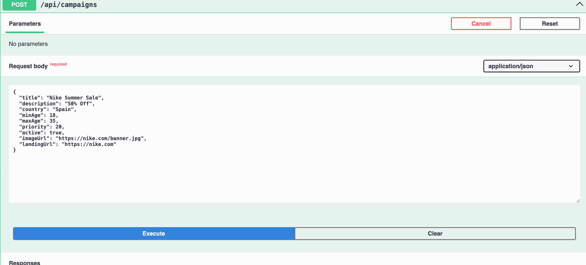
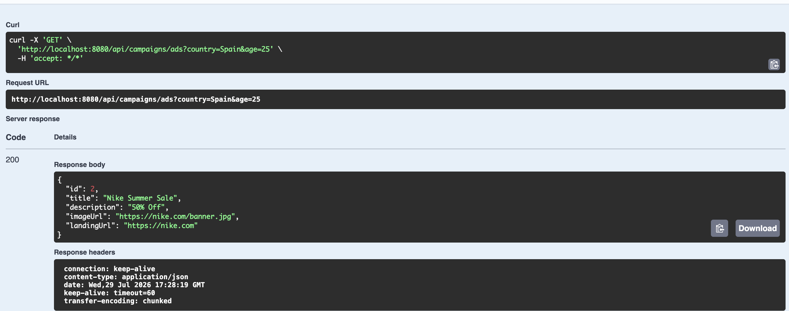

# 🚀 Real-Time Ad Serving Platform

A backend application built with **Java 17** and **Spring Boot** that simulates a real-time advertisement serving system. The platform dynamically serves the highest-priority advertisement based on user demographics such as **country** and **age**.

---

## 📌 Features

- ✅ Campaign Management (CRUD APIs)
- ✅ Real-Time Ad Serving API
- ✅ Campaign Priority Selection
- ✅ PostgreSQL Integration
- ✅ Docker Support
- ✅ Swagger (OpenAPI) Documentation
- ✅ Global Exception Handling
- ✅ Layered Architecture (Controller → Service → Repository)

---

## 🛠 Tech Stack

| Technology | Description |
|------------|-------------|
| Java 17 | Programming Language |
| Spring Boot 3.5 | Backend Framework |
| Spring Data JPA | Database Access |
| PostgreSQL | Relational Database |
| Docker | Containerization |
| Swagger | API Documentation |
| Maven | Build Tool |
| Lombok | Boilerplate Code Reduction |
| Git & GitHub | Version Control |

---

## 🏗 Project Architecture

```text
                    Client / Swagger
                           │
                           ▼
                 CampaignController
                           │
                           ▼
                  CampaignService
                           │
          ┌────────────────┴───────────────┐
          ▼                                ▼
 CampaignRepository                 Ad Selection Logic
          │
          ▼
      PostgreSQL Database
```
---

## 📡 REST API Endpoints

| Method | Endpoint | Description |
|--------|----------|-------------|
| POST | `/api/campaigns` | Create Campaign |
| GET | `/api/campaigns` | Get All Campaigns |
| GET | `/api/campaigns/{id}` | Get Campaign By ID |
| PUT | `/api/campaigns/{id}` | Update Campaign |
| DELETE | `/api/campaigns/{id}` | Delete Campaign |
| GET | `/api/campaigns/ads` | Serve Matching Advertisement |

---


## 📷 Screenshots

### Architecture


### Swagger UI


### Create Campaign



### Ad Serving API

_


---

## 🚀 Future Enhancements

- Redis Caching
- JWT Authentication
- Campaign Analytics
- Click & Impression Tracking
- Kubernetes Deployment

---

## 👨‍💻 Author

**Pavithra**

GitHub: https://github.com/Pavithrajeni